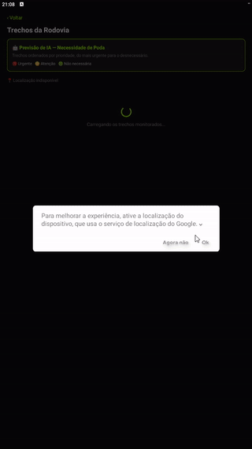

# PrognosisHerba 🌿

Aplicativo mobile desenvolvido para o **Challenge CCR Motiva — Sprints 1, 2 e 3**, com foco no monitoramento, planejamento e gestão de vegetação em rodovias concedidas.

> **Sprint 3 — protótipo funcional completo.** Todos os fluxos principais e secundários estão
> implementados e navegáveis, com mock de dados cobrindo sucesso, erro, listas vazias e
> fluxos alternativos. Veja o [documento de testes manuais](./TESTES_MANUAIS.md).

---

# 📖 Sobre o Projeto

O **PrognosisHerba** foi criado para auxiliar operadores de campo, supervisores e gestores responsáveis pela conservação de rodovias da Motiva.

A solução busca otimizar o processo de monitoramento e planejamento de podas e manutenção da vegetação, ajudando equipes operacionais a registrarem atividades de campo, acompanharem cronogramas e organizarem intervenções com mais eficiência.

O projeto foi desenvolvido considerando o contexto operacional apresentado pela CCR Motiva, incluindo:
- Conservação de rodovias;
- Gestão de equipes de poda;
- Necessidades operacionais de campo;
- Controle de atividades semanais;
- Organização de informações operacionais.

---

# 🎯 Problema Escolhido

Atualmente, equipes responsáveis pela conservação vegetal em rodovias enfrentam dificuldades relacionadas a:
- Organização manual das atividades;
- Falta de centralização das informações;
- Dificuldade no acompanhamento das podas programadas;
- Comunicação operacional pouco eficiente;
- Necessidade de maior controle das atividades executadas em campo.

---

# 💡 Proposta da Solução

O **PrognosisHerba** propõe uma solução mobile para:
- Planejar atividades de poda;
- Visualizar tarefas diárias e semanais;
- Organizar cronogramas operacionais;
- Facilitar o acompanhamento das equipes;
- Centralizar informações operacionais em um único sistema.

A aplicação possui um fluxo simples e intuitivo para facilitar o uso em campo.

---

# 👤 Persona Principal

## Nome:
Carlos Henrique

## Idade:
38 anos

## Cargo:
Supervisor de Conservação Rodoviária

## Objetivos:
- Organizar equipes de poda;
- Monitorar atividades programadas;
- Melhorar o controle operacional;
- Garantir maior eficiência na conservação das rodovias.

## Dores:
- Falta de padronização dos registros;
- Controle operacional descentralizado;
- Dificuldade de acompanhamento em tempo real;
- Alto volume de atividades manuais.

---

# 📸 Telas do App

<p align="center">
  
  <br/>
  <sub><b>Trechos da Rodovia</b> — carregamento, previsão de IA por trecho e destaque do mais próximo via GPS</sub>
</p>

<table>
  <tr>
    <td align="center"><b>Login</b><br/></td>
    <td align="center"><b>Registro</b><br/></td>
  </tr>
  <tr>
    <td align="center"><b>Dashboard</b><br/></td>
    <td align="center"><b>Trechos da Rodovia — Previsão de IA</b><br/></td>
  </tr>
  <tr>
    <td align="center" colspan="2"><b>Trechos da Rodovia — Lista completa</b><br/></td>
  </tr>
</table>

---

# 🛠️ Stack Tecnológica

| Tecnologia | Versão | Finalidade |
|---|---|---|
| React Native | 0.81.5 | Desenvolvimento mobile cross-platform |
| Expo | ~54.0.33 | Ambiente de desenvolvimento e build |
| React Navigation | ^7 | Navegação entre telas |
| AsyncStorage | 2.2.0 | Persistência local de sessão e dados mockados |
| expo-location | ~19.0.8 | Geolocalização (GPS) do operador |
| Jest | ^29 | Testes automatizados |
| jest-expo | ^55 | Integração de testes com Expo |
| Testing Library | ^13 | Testes de componentes |

---

# ✅ Justificativa da Stack

### React Native
Permite desenvolvimento multiplataforma com alta produtividade e reutilização de código.

### Expo
Facilita configuração, testes e execução do projeto durante o desenvolvimento acadêmico.

### React Navigation
Estrutura a navegação entre telas de forma organizada e escalável.

### AsyncStorage
Permite persistência local de sessão e dos dados mockados de trechos/inspeções, sem necessidade de backend nestas Sprints.

### expo-location
Fornece acesso simples e multiplataforma ao GPS do dispositivo, usado para calcular a distância do operador até cada trecho e destacar o mais próximo.

### Jest + Testing Library
Garantem qualidade, previsibilidade e cobertura de testes utilizando abordagem TDD.

---

# 📱 Fluxo da Aplicação

```txt
Inicialização
    │
    ├─ Sessão salva? ──Sim──▶ Dashboard
    │
    └─ Não ──▶ Registro ⇄ Login ──▶ Dashboard
                                        │
        ┌───────────────┬───────────────┼────────────────┬──────────────┐
        ▼               ▼               ▼                ▼              ▼
   Notificações      Agenda      Confirmar Poda      Trechos da      Perfil
        │          da Semana        / Não Poda          Rodovia          │
        │               │                                 │          Modo de
        └───────────────┴────────▶ Detalhe do Trecho ◀─────┘      demonstração
                                          │                             │
                              Inspeção + Feedback da IA              Logout
```

Todas as setas acima são navegáveis no app — não há tela sem saída nem botão sem ação.

---

# 🖥️ Telas Implementadas

## RegisterScreen
Tela responsável pelo cadastro de usuários.

### Funcionalidades:
- Cadastro com email e senha;
- Validação de email;
- Confirmação de senha;
- Navegação para login.

---

## LoginScreen
Tela responsável pela autenticação do usuário.

### Funcionalidades:
- Login com email e senha;
- Persistência de sessão;
- Navegação automática para dashboard.

---

## DashboardScreen
Tela principal do sistema.

### Funcionalidades:
- Visualização das atividades do dia;
- Visualização do cronograma semanal;
- Resumo operacional;
- Acesso aos "Trechos da Rodovia";
- Logout da aplicação.

---

## TrechosScreen
Lista os trechos da rodovia monitorados.

### Funcionalidades:
- Listagem dos trechos com status de vegetação (Conforme / Atenção / Crítico);
- Localização do operador via GPS e destaque do trecho mais próximo;
- Banner "Previsão de IA" com legenda dos níveis (Urgente / Atenção / Não necessária);
- Ordenação dos trechos por prioridade da previsão de IA, com desempate por distância.

---

## TrechoDetailScreen
Tela de detalhe de um trecho da rodovia.

### Funcionalidades:
- Exibição dos dados do trecho e histórico de inspeções;
- Previsão de IA (nível, confiança e motivo);
- Formulário para registrar nova inspeção (status + observação) com validação;
- Feedback do podador sobre a execução da poda e o acerto da previsão de IA;
- Estados de carregamento, erro (trecho não encontrado / falha de API) e histórico vazio.

---

## NotificacoesScreen *(Sprint 3)*
Central de alertas operacionais e do modelo de IA.

### Funcionalidades:
- Lista de notificações por tipo (alerta, previsão de IA, agenda, sistema);
- Destaque visual e contador das não lidas, refletido no badge do Dashboard;
- Toque na notificação marca como lida e abre o trecho relacionado;
- "Marcar todas como lidas", pull-to-refresh e estados de carregamento / erro / lista vazia.

---

## AgendaScreen *(Sprint 3)*
Calendário da escala semanal do operador.

### Funcionalidades:
- Cinco dias da semana com turno, equipe, trecho, rodovia e descrição;
- Status por dia: Concluída, Confirmada, Programada e Ausência justificada;
- Destaque do dia atual e atalho para o detalhe do trecho alocado;
- Pull-to-refresh e estados de carregamento / erro / escala não publicada.

---

## RegistrarPodaScreen *(Sprint 3)*
Tela única que atende os dois cards de "Atividades do Dia".

### Funcionalidades:
- **Confirmar Poda**: escolha do turno (Manhã / Integral / Tarde) + observação;
- **Informar Ausência** (fluxo alternativo): motivo pré-definido + justificativa;
- Validação por campo, incluindo justificativa obrigatória em "Outro motivo";
- Aviso de conflito quando já existe registro contrário para o mesmo dia;
- O registro atualiza a Agenda e o card do Dashboard.

---

## PerfilScreen *(Sprint 3)*
Dados do operador e configurações do app.

### Funcionalidades:
- Perfil operacional (nome, cargo, matrícula, equipe, regional, telefone);
- **Modo de demonstração**: alterna os cenários da camada de mock em tempo de execução;
- "Restaurar dados de demonstração", que devolve trechos, agenda e notificações ao original;
- Logout da conta.

---

# 📂 Estrutura do Projeto

```txt
PrognosisHerba/
├── App.js                        # Navegação e verificação de sessão
├── index.js                      # Registro do app no Expo
├── app.json                      # Configuração Expo (inclui plugin expo-location)
├── assets/
│   ├── logoPrognosisherba.png
│   ├── icon.png / adaptive-icon.png / splash-icon.png / favicon.png
│   └── screenshots/               # Capturas de tela usadas neste README
├── TESTES_MANUAIS.md              # Documento de testes manuais da Sprint 3
├── src/
│   ├── components/                # Componentes reutilizáveis (identidade visual única)
│   │   ├── AppLogo.js             # Logo (Register/Login)
│   │   ├── ScreenHeader.js        # Voltar + título + subtítulo das telas internas
│   │   ├── Card.js                # Bloco de conteúdo, clicável quando recebe onPress
│   │   ├── PrimaryButton.js       # Botão padrão (primary / secondary / danger + loading)
│   │   ├── FormInput.js           # Rótulo + input + mensagem de erro
│   │   ├── StateView.js           # Estados de carregamento, erro e lista vazia
│   │   ├── InlineMessage.js       # Retorno de formulário (sucesso / erro / info)
│   │   ├── StatusBadge.js         # Selo colorido de status
│   │   ├── FilterChips.js         # Barra de filtros por status
│   │   └── OptionRow.js           # Linha de seleção única (turno, motivo, cenário)
│   ├── constants/
│   │   ├── previsaoIA.js          # Níveis de previsão de IA (emoji, cor, prioridade)
│   │   └── statusVegetacao.js     # Status de vegetação (emoji, cor, gravidade)
│   ├── mocks/
│   │   ├── trechosMock.js         # 5 trechos de rodovias da Motiva
│   │   ├── agendaMock.js          # Escala da semana, turnos e motivos de ausência
│   │   ├── notificacoesMock.js    # Notificações operacionais e de IA
│   │   ├── usuarioMock.js         # Operador e conta de demonstração
│   │   └── mockScenarios.js       # Cenários: sucesso, vazio, erro e lento
│   ├── screens/
│   │   ├── RegisterScreen.js
│   │   ├── LoginScreen.js
│   │   ├── DashboardScreen.js
│   │   ├── TrechosScreen.js       # Lista + GPS + IA + filtros + estados
│   │   ├── TrechoDetailScreen.js  # Detalhe, histórico, inspeção e feedback
│   │   ├── NotificacoesScreen.js  # Central de notificações
│   │   ├── AgendaScreen.js        # Escala da semana
│   │   ├── RegistrarPodaScreen.js # Confirmar poda / informar ausência
│   │   └── PerfilScreen.js        # Perfil + modo de demonstração + logout
│   ├── services/
│   │   ├── AuthService.js         # Sessão, cadastro e login (mock)
│   │   ├── TrechosService.js      # Mock + AsyncStorage de trechos/inspeções
│   │   ├── AgendaService.js       # Escala, confirmação de poda e ausência
│   │   ├── NotificacoesService.js # Notificações e controle de leitura
│   │   ├── MockScenarioService.js # Aplica o cenário ativo às respostas dos services
│   │   └── LocationService.js     # Wrapper do expo-location (GPS)
│   └── theme/
│       └── colors.js              # Paleta de cores do app
└── __tests__/                     # 18 suítes / 179 testes
    ├── AppNavigation.test.js          ├── AgendaService.test.js
    ├── AuthService.test.js            ├── NotificacoesService.test.js
    ├── LocationService.test.js        ├── MockScenarioService.test.js
    ├── TrechosService.test.js         ├── AgendaScreen.test.js
    ├── RegisterScreen.test.js         ├── NotificacoesScreen.test.js
    ├── LoginScreen.test.js            ├── RegistrarPodaScreen.test.js
    ├── DashboardScreen.test.js        ├── PerfilScreen.test.js
    ├── DashboardHeader.test.js        ├── TrechosScreenEstados.test.js
    ├── TrechosScreen.test.js          └── TrechoDetailScreen.test.js
```

---

# 🧪 Testes

O projeto utiliza abordagem **TDD (Test Driven Development)**: os testes são escritos antes da implementação.

## Cobertura atual:
- Navegação (sessão salva → Dashboard / sem sessão → Registro);
- Cadastro, validação de email/senha e recusa de email já cadastrado;
- Login com credenciais válidas e inválidas, e persistência de sessão;
- Dashboard (conteúdo, badge de notificações e destino de **todos** os cards);
- Trechos da Rodovia (listagem, status, GPS, previsão de IA, filtros e estados);
- Detalhe do trecho (histórico, inspeção, feedback, validações e falha de gravação);
- Agenda, Notificações, Confirmar Poda / Informar Ausência e Perfil;
- Cenários de mock: sucesso, lista vazia, erro de conexão e resposta lenta;
- Serviços: AuthService, TrechosService, LocationService, AgendaService,
  NotificacoesService e MockScenarioService.

## Total:
✅ **179 testes passando em 18 suítes** (Sprint 2: 87 testes em 9 suítes).

O bundle de produção também foi verificado com
`npx expo export --platform android` → **864 módulos, 0 erros**.

---

# 🔒 Requisitos Funcionais (RF)

| Código | Requisito |
|---|---|
| RF01 | O usuário deve conseguir realizar cadastro |
| RF02 | O usuário deve conseguir realizar login |
| RF03 | O sistema deve validar email |
| RF04 | O sistema deve validar confirmação de senha |
| RF05 | O sistema deve persistir sessão |
| RF06 | O usuário deve visualizar atividades diárias |
| RF07 | O usuário deve visualizar cronograma semanal |
| RF08 | O usuário deve conseguir realizar logout |
| RF09 | O sistema deve listar os trechos da rodovia com status de vegetação |
| RF10 | O sistema deve obter a localização do operador via GPS e destacar o trecho mais próximo |
| RF11 | O sistema deve exibir uma previsão de IA sobre a necessidade de poda por trecho |
| RF12 | O usuário deve conseguir registrar uma nova inspeção (status + observação) em um trecho |
| RF13 | O usuário deve conseguir registrar feedback sobre a poda realizada e o acerto da previsão de IA |
| RF14 | O usuário deve conseguir consultar suas notificações e marcá-las como lidas |
| RF15 | O usuário deve conseguir visualizar a escala da semana em um calendário |
| RF16 | O usuário deve conseguir confirmar a poda do dia informando o turno |
| RF17 | O usuário deve conseguir informar e justificar a ausência no dia |
| RF18 | O usuário deve conseguir filtrar os trechos por status de vegetação |
| RF19 | O usuário deve conseguir consultar seu perfil operacional |
| RF20 | O sistema deve comunicar carregamento, listas vazias e erros de carregamento, com nova tentativa |

---

# ⚙️ Requisitos Não Funcionais (RNF)

| Código | Requisito |
|---|---|
| RNF01 | O app deve funcionar em Android e iOS |
| RNF02 | O sistema deve possuir interface responsiva |
| RNF03 | O sistema deve possuir navegação intuitiva |
| RNF04 | O sistema deve manter persistência local de sessão |
| RNF05 | O código deve possuir testes automatizados |
| RNF06 | O sistema deve possuir identidade visual consistente |
| RNF07 | O sistema deve solicitar permissão de localização ao usuário antes de usar o GPS |
| RNF08 | O sistema deve informar o usuário em caso de falha de carregamento, oferecendo nova tentativa |
| RNF09 | A interface deve ser construída sobre componentes reutilizáveis compartilhados entre as telas |
| RNF10 | Nenhuma tela pode ficar sem saída de navegação nem apresentar controles sem ação |

---

# 🎨 Identidade Visual

O projeto utiliza uma identidade visual dark com verde neon inspirado em:
- Tecnologia;
- Natureza;
- Monitoramento ambiental.

## Paleta de cores

| Elemento | Cor |
|---|---|
| Fundo | `#111111` |
| Cards | `#1C1C1C` |
| Verde Primário | `#AAFF00` |
| Texto | `#FFFFFF` |
| Erro | `#FF4444` |

---

# 🚀 Como Rodar o Projeto

## Instalar dependências

```bash
npm install
```

## Iniciar projeto

```bash
npm start
```

## Android

```bash
npm run android
```

---

# 🧪 Rodar Testes

```bash
npm test
```

---

# 🔗 Protótipo Figma

```txt
https://www.figma.com/design/U65XJovakZgKdhKiMNkwNe/PrognosisHerba?node-id=0-1&t=kPh46l4wXuSrPu0r-0
```

---

# 🚀 Sprint 2 — Mock de Dados, GPS e Fluxo Funcional

A Sprint 2 evolui o app de um protótipo de autenticação para um app funcional com dados
mockados, recurso nativo (GPS) e um fluxo completo de interação.

### Mock de dados — `src/mocks/trechosMock.js`

Representa **5 trechos** das rodovias concedidas à Motiva (Anhanguera SP-330, Bandeirantes
SP-348, Castello Branco SP-280, Raposo Tavares SP-270 e Rodoanel SP-021), cada um com:

- `rodovia`, `km` e `nomeTrecho`
- `latitude` / `longitude` (usadas pelo recurso de GPS)
- `statusVegetacao`: `Conforme` 🟢 | `Atenção` 🟡 | `Crítico` 🔴
- `ultimaInspecao` e `historico` de inspeções anteriores (data, status, observação, técnico)
- `previsaoIA`: `{ nivel, confianca, motivo }` — previsão automática da necessidade de poda
  (`Urgente` 🔴 | `Atenção` 🟡 | `Não necessária` 🟢), com % de confiança e justificativa
- `feedbackPodador`: `{ podaRealizada, previsaoCorreta, dataFeedback }` — feedback do
  operador sobre a execução da poda e o acerto da previsão da IA

Esses dados simulam o que viria de uma API real de monitoramento de vegetação por trecho.

### Camada de mock — `src/services/TrechosService.js`

Segue o mesmo padrão do `AuthService`: lê/grava no `AsyncStorage` (chave
`@prognosisherba:trechos`). Na primeira execução, semeia o storage com `trechosMock.js`.
Expõe:

- `getTrechos()` — lista todos os trechos (faz *backfill* de `previsaoIA`/`feedbackPodador`
  em dados persistidos antes dessa feature existir)
- `getTrechoById(id)` — busca um trecho específico
- `registerInspecao(trechoId, { status, observacao, tecnico })` — registra uma nova
  inspeção, atualiza o status de vegetação e o histórico, e persiste a alteração
- `registerFeedback(trechoId, { podaRealizada, previsaoCorreta })` — registra o feedback
  do podador sobre a execução da poda e o acerto da previsão de IA, com data

### Recurso nativo — GPS (`src/services/LocationService.js`)

Usa `expo-location` para obter a localização atual do operador
(`requestForegroundPermissionsAsync` + `getCurrentPositionAsync`). A localização é
combinada com as coordenadas de cada trecho (via cálculo de distância Haversine) para
destacar o **trecho mais próximo do operador** na lista — conectando um recurso nativo do
device diretamente ao mock de dados.

### Previsão de IA e feedback do podador

A `TrechosScreen` exibe um banner "🤖 Previsão de IA — Necessidade de Poda" com a legenda
dos 3 níveis (`src/constants/previsaoIA.js`) e ordena os trechos por prioridade — do mais
urgente para o desnecessário, com desempate pela distância GPS até o operador. Cada card
mostra um selo com o nível e a confiança da previsão (ex.: `🤖 IA: 🔴 Urgente • 94% de
confiança`).

Na `TrechoDetailScreen`, a seção "🤖 Previsão de IA" mostra o nível, a confiança (%) e o
motivo da classificação. Na seção "Feedback da poda", o operador responde se realizou a
poda e se a previsão da IA acertou o nível de urgência; o `TrechosService.registerFeedback`
persiste essa resposta com a data, simulando o ciclo de avaliação do modelo.

### Fluxo funcional demonstrado

```
Dashboard ──▶ "Trechos da Rodovia" ──▶ Lista de Trechos (status + GPS)
                                              │
                                              ▼
                                      Detalhe do Trecho
                                              │
                              Seleciona status + observação
                                              │
                                    "Registrar Inspeção"
                                              │
                          TrechosService atualiza o mock (AsyncStorage)
                                              │
                  Status do trecho e histórico são atualizados na tela
                          e refletidos na lista ao voltar
```

Esse fluxo demonstra a ação do usuário (registrar inspeção) alterando os dados mockados e
a interface refletindo o novo estado em tempo real, sem depender de uma API externa.

### Permissão de localização

O `app.json` inclui o plugin `expo-location` com a descrição de uso da permissão
(`locationWhenInUsePermission`). Ao abrir a tela **Trechos da Rodovia** pela primeira vez em
um dispositivo físico, o app solicitará permissão de localização ao usuário.

---

# 🚀 Sprint 3 — Protótipo Funcional Completo

A Sprint 3 fecha o app: **todos** os fluxos definidos nas Sprints anteriores estão
implementados e navegáveis, a camada de mock passou a cobrir os cenários completos da
solução e a interface foi unificada sobre componentes reutilizáveis.

## 1. Por que continuamos em React Native (e não migramos para Flutter)

A migração para Flutter era opcional. Optamos por **manter React Native + Expo**:

- O escopo das Sprints 1 e 2 já estava entregue, testado e validado nesta stack — migrar
  significaria reescrever 5 telas, 3 services e 87 testes apenas para chegar ao mesmo ponto,
  consumindo a Sprint inteira sem entregar nenhum fluxo novo;
- O Expo já resolve o recurso nativo que a solução exige (GPS via `expo-location`), com
  permissão declarada no `app.json` e funcionando em Android e iOS;
- A equipe tem domínio de JavaScript/React, o que permitiu usar a Sprint para **ampliar o
  escopo** (4 telas novas, cenários de mock, componentes reutilizáveis) em vez de reconstruir
  o que já existia;
- A suíte automatizada com Jest + Testing Library foi preservada e ampliada de 87 para 179
  testes, servindo de rede de segurança durante toda a refatoração.

## 2. Fluxos que estavam incompletos e foram fechados

Na Sprint 2, vários controles do Dashboard eram `TouchableOpacity` **sem `onPress`** — ou
seja, botões que não faziam nada. Esta Sprint eliminou todos eles:

| Controle | Antes (Sprint 2) | Agora (Sprint 3) |
|---|---|---|
| 🔔 Sino de notificações | Sem ação | Abre `NotificacoesScreen`, com badge de não lidas |
| Card "Poda" | Sem ação | Abre `RegistrarPodaScreen` (confirmação de turno) |
| Card "Não Poda" | Sem ação | Abre `RegistrarPodaScreen` (justificativa de ausência) |
| "Ver calendário" | Sem ação | Abre `AgendaScreen` |
| Itens de "Atividades da Semana" | Sem ação | Abrem `AgendaScreen` |
| Acesso ao perfil | Não existia | Ícone 👤 abre `PerfilScreen` |

Outros dois defeitos de navegação também foram corrigidos:

- **Pilha de navegação após login/logout**: o app usava `navigate`, então o botão "voltar" do
  Android devolvia o usuário à tela de Login depois de entrar (e ao Dashboard depois de sair).
  Agora usa `navigation.reset`, e a tela anterior deixa de existir na pilha.
- **Lista de trechos desatualizada**: uma inspeção registrada no detalhe não aparecia na lista
  ao voltar, porque a tela só carregava na montagem. Agora recarrega com `useFocusEffect`.

## 3. Evolução da camada de mock — cenários completos

A Sprint pede mocks cobrindo *sucesso, erro, listas vazias e fluxos alternativos*. Em vez de
deixar esses estados presos no código, criamos o **Modo de demonstração** (`PerfilScreen`),
que troca o comportamento da camada de mock em tempo de execução:

```txt
Tela  ──▶  Service  ──▶  MockScenarioService.aplicar()  ──▶  resposta
                                    │
             ┌──────────────┬───────┴───────┬────────────────┐
             ▼              ▼               ▼                ▼
        ✅ sucesso     📭 vazio        ⚠️ erro          🐢 lento
        dados reais    retorna []   lança MockApiError   +2,5 s
```

| Cenário | O que a interface mostra |
|---|---|
| ✅ **Dados completos** | Listas preenchidas — comportamento padrão |
| 📭 **Listas vazias** | Estados "Nenhum trecho monitorado", "Nenhuma notificação por aqui", "Nenhuma diária programada" |
| ⚠️ **Erro de conexão** | Tela de erro com a causa e o botão **TENTAR NOVAMENTE**; gravações falham **sem corromper** os dados salvos |
| 🐢 **Resposta lenta** | Indicadores de carregamento ficam visíveis por ~2,5 s |

O cenário fica persistido em `AsyncStorage`, e "Restaurar dados de demonstração" devolve
trechos, agenda, notificações e cenário ao estado original do mock — útil para repetir a
demonstração do zero.

### Novos mocks

| Arquivo | Conteúdo |
|---|---|
| `agendaMock.js` | Escala de 15 a 19 de junho de 2026 com 4 status diferentes, 3 turnos e 5 motivos de ausência |
| `notificacoesMock.js` | 5 notificações de 4 tipos, com lidas e não lidas, ligadas aos trechos |
| `usuarioMock.js` | Operador (nome, cargo, matrícula, equipe, regional) e conta de demonstração |
| `mockScenarios.js` | Definição dos 4 cenários e do erro simulado (`MockApiError`) |

As datas de todos os mocks foram alinhadas à mesma semana de referência, para que agenda,
notificações e histórico de inspeções contem uma história coerente.

## 4. Consistência visual — componentes reutilizáveis

A interface da Sprint 2 repetia estilos dentro de cada tela (cada uma tinha seu próprio card,
botão, input e selo). A Sprint 3 extraiu esses padrões para `src/components/`:

| Componente | Usado em |
|---|---|
| `ScreenHeader` | Trechos, Detalhe, Notificações, Agenda, Registrar Poda, Perfil |
| `Card` | Dashboard, Detalhe, Registrar Poda, Perfil |
| `PrimaryButton` | Todas as telas com ação (3 variantes + estado de carregamento) |
| `FormInput` | Registro, Login, Detalhe, Registrar Poda |
| `StateView` | Todas as listas (carregando / erro / vazio) |
| `InlineMessage` | Todos os formulários (sucesso / erro / info) |
| `StatusBadge` | Trechos, Notificações, Agenda |
| `FilterChips` | Trechos |
| `OptionRow` | Registrar Poda, Perfil |

Os valores de status também foram centralizados: `constants/statusVegetacao.js` passou a ser a
única fonte de emoji, cor e gravidade — antes essa tabela estava duplicada em duas telas.

---

# 📊 Status de cada funcionalidade

| # | Funcionalidade | Status | Observação |
|---|---|---|---|
| 1 | Cadastro de usuário | ✅ Completo | Valida email, senha e duplicidade de conta |
| 2 | Login e persistência de sessão | ✅ Completo | Credenciais mockadas; recusa senha incorreta |
| 3 | Logout | ✅ Completo | Disponível no Dashboard e no Perfil; reseta a pilha |
| 4 | Dashboard operacional | ✅ Completo | Todos os cards com destino definido |
| 5 | Notificações | ✅ Completo | Leitura individual, em massa e badge no Dashboard |
| 6 | Agenda da semana | ✅ Completo | 4 status de diária e atalho para o trecho |
| 7 | Confirmar poda do dia | ✅ Completo | Turno + observação; reflete na agenda |
| 8 | Informar ausência (fluxo alternativo) | ✅ Completo | Motivo + justificativa; detecta conflito |
| 9 | Lista de trechos | ✅ Completo | Ordenação por IA, filtros e pull-to-refresh |
| 10 | GPS e trecho mais próximo | ✅ Completo | Trata permissão negada sem quebrar a tela |
| 11 | Previsão de IA por trecho | ⚠️ Mockado | Nível, confiança e motivo vêm do mock, não de um modelo |
| 12 | Registro de inspeção | ✅ Completo | Valida campos e atualiza status, histórico e lista |
| 13 | Feedback do podador sobre a IA | ⚠️ Parcial | É gravado, mas ainda não há tela que consolide o acerto do modelo |
| 14 | Perfil do operador | ✅ Completo | Somente leitura — edição não faz parte do escopo |
| 15 | Estados de carregamento / erro / vazio | ✅ Completo | Presentes em todas as listas e formulários |
| 16 | Modo de demonstração (cenários de mock) | ✅ Completo | Recurso de apoio; sai na versão de produção |
| 17 | Integração com API real | ❌ Não iniciado | Fora do escopo das Sprints 1–3 |
| 18 | Notificações push | ❌ Não iniciado | Hoje são apenas dados mockados na tela |

**Legenda:** ✅ completo e navegável · ⚠️ funciona, com limitação conhecida · ❌ não iniciado

---

# 🔧 Pendências identificadas

Levantadas durante a execução dos [testes manuais](./TESTES_MANUAIS.md). Nenhuma delas
impede o uso do protótipo — são limitações conscientes, listadas de forma honesta.

| # | Pendência | Impacto | Prioridade |
|---|---|---|---|
| P1 | Autenticação simulada; senhas em texto puro no AsyncStorage | Não é seguro para uso real | Alta |
| P2 | Sem API — dados não sincronizam entre aparelhos | Cada instalação tem seus próprios dados | Alta |
| P3 | Previsão de IA é campo estático do mock | Não há inferência real | Alta |
| P4 | Data de referência da agenda é fixa (16/06/2026) | Mantém o mock coerente, mas não acompanha o calendário | Média |
| P5 | Sem recuperação de senha | Usuário que esquece a senha precisa recadastrar | Média |
| P6 | Feedback da IA gravado mas não consolidado em nenhuma tela | O ciclo de avaliação do modelo fica incompleto | Média |
| P7 | Sem fila de sincronização offline | Registro feito sem rede não é reenviado | Média |
| P8 | Inspeção aceita apenas texto, sem foto | Reduz a evidência de campo | Média |
| P9 | GPS calcula distância, mas não há mapa | Menor leitura espacial dos trechos | Baixa |
| P10 | "Modo de demonstração" visível no app | Precisa virar flag de build na versão final | Baixa |
| P11 | Acessibilidade não revisada (contraste / leitor de tela) | Limita usuários com deficiência | Baixa |
| P12 | Sem testes end-to-end | A cobertura é de unidade e componente | Baixa |

---

# 🗺️ Plano de ajustes para a Sprint 4

| Ordem | Ajuste planejado | Pendência que resolve | Entrega esperada |
|---|---|---|---|
| 1 | Substituir a camada de mock por um cliente HTTP real, mantendo a mesma interface dos services | P2 | Services consumindo API sem alterar as telas |
| 2 | Autenticação real com token e senha protegida | P1 | Login/cadastro contra o backend |
| 3 | Tela de desempenho da IA consolidando os feedbacks dos podadores | P3, P6 | Percentual de acerto do modelo por trecho e por período |
| 4 | Agenda ligada à data real do dispositivo | P4 | "Hoje" acompanha o calendário |
| 5 | Anexo de foto no registro de inspeção | P8 | Evidência visual junto da observação |
| 6 | Fila de sincronização offline | P7 | Registros feitos sem rede reenviados ao reconectar |
| 7 | Recuperação de senha | P5 | Fluxo "Esqueci minha senha" |
| 8 | Remover o "Modo de demonstração" da build de produção | P10 | Recurso ativo apenas em build de desenvolvimento |
| 9 | Revisão de acessibilidade e mapa dos trechos | P9, P11 | Contraste revisado e visualização em mapa |
| 10 | Testes end-to-end dos 5 fluxos principais | P12 | Suíte E2E rodando junto dos testes de unidade |

> A ordem prioriza o que destrava a integração real (itens 1 e 2), porque todos os demais
> ajustes dependem de os dados deixarem de ser locais.

---

# 👥 Integrantes

| Nome | RM |
|---|---|
| Leonardo Lopes Oliveira | RM565437 |
| Lucas Ferrari Lima | RM563119 |
| Carlos Eduardo Pires Cervelli | RM563462 |
| Felipe Krzyzanovski dos Santos Menezes | RM564878 |
| Arthur de Souza Matos Dias | RM566068 |
| Guilherme Carreri Giampietro | RM565676 |
| Mateus Patrício Pereira | RM564695 |

---

# 📌 Status do Projeto

✅ **Sprint 1 concluída** — autenticação (cadastro, login, sessão) e dashboard
✅ **Sprint 2 concluída** — trechos da rodovia, GPS, mock de dados, previsão de IA e feedback do podador
✅ **Sprint 3 concluída** — protótipo funcional completo: 9 telas navegáveis, 4 cenários de mock,
componentes reutilizáveis, 179 testes automatizados e [documento de testes manuais](./TESTES_MANUAIS.md)
🚧 **Sprint 4** — integração com API real, conforme o plano de ajustes acima

| Sprint | Telas | Testes automatizados |
|---|---|---|
| Sprint 2 | 5 | 87 |
| **Sprint 3** | **9** | **179** |
