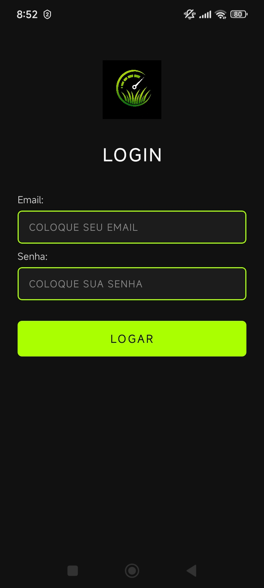
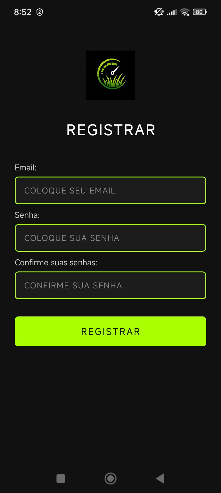
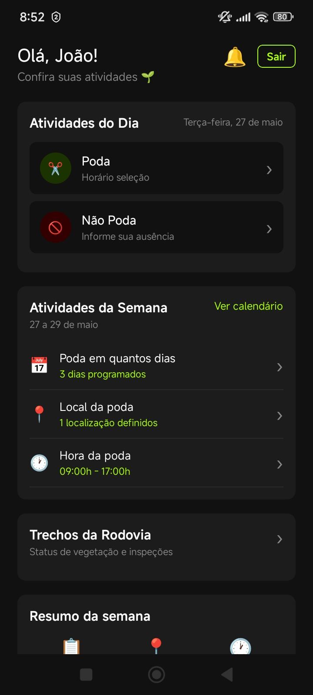
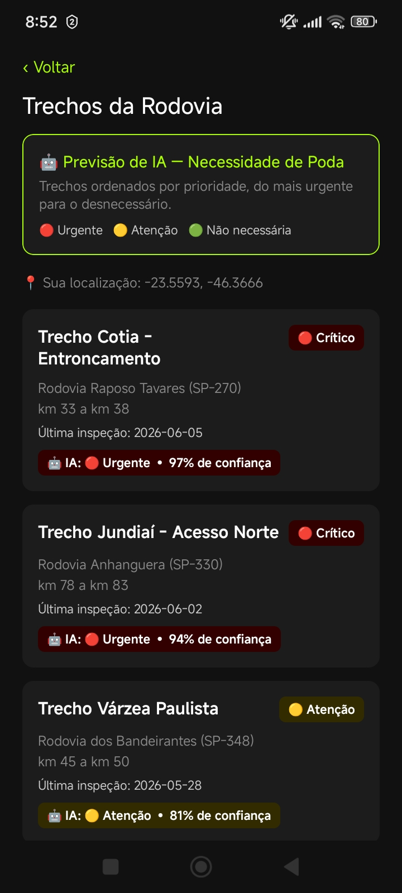
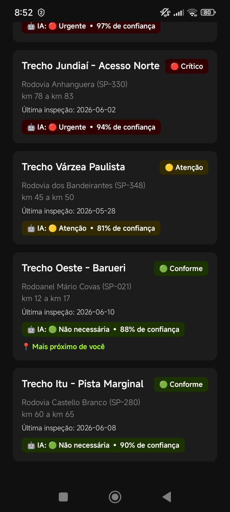

# PrognosisHerba 🌿

Aplicativo mobile desenvolvido para o **Challenge CCR Motiva — Sprints 1 e 2**, com foco no monitoramento, planejamento e gestão de vegetação em rodovias concedidas.

---

# 📖 Sobre o Projeto

O **PrognosisHerba** foi criado para auxiliar operadores de campo, supervisores e gestores responsáveis pela conservação de rodovias da Motiva.

A solução busca otimizar o processo de monitoramento e planejamento de podas e manutenção da vegetação, ajudando equipes operacionais a registrarem atividades de campo, acompanharem cronogramas e organizarem intervenções com mais eficiência.

O projeto foi desenvolvido considerando o contexto operacional apresentado pela CCR Motiva, incluindo:
- Conservação de rodovias;
- Gestão de equipes de poda;
- Necessidades operacionais de campo;
- Controle de atividades semanais;
- Organização de informações operacionais.

---

# 🎯 Problema Escolhido

Atualmente, equipes responsáveis pela conservação vegetal em rodovias enfrentam dificuldades relacionadas a:
- Organização manual das atividades;
- Falta de centralização das informações;
- Dificuldade no acompanhamento das podas programadas;
- Comunicação operacional pouco eficiente;
- Necessidade de maior controle das atividades executadas em campo.

---

# 💡 Proposta da Solução

O **PrognosisHerba** propõe uma solução mobile para:
- Planejar atividades de poda;
- Visualizar tarefas diárias e semanais;
- Organizar cronogramas operacionais;
- Facilitar o acompanhamento das equipes;
- Centralizar informações operacionais em um único sistema.

A aplicação possui um fluxo simples e intuitivo para facilitar o uso em campo.

---

# 👤 Persona Principal

## Nome:
Carlos Henrique

## Idade:
38 anos

## Cargo:
Supervisor de Conservação Rodoviária

## Objetivos:
- Organizar equipes de poda;
- Monitorar atividades programadas;
- Melhorar o controle operacional;
- Garantir maior eficiência na conservação das rodovias.

## Dores:
- Falta de padronização dos registros;
- Controle operacional descentralizado;
- Dificuldade de acompanhamento em tempo real;
- Alto volume de atividades manuais.

---

# 📸 Telas do App

<table>
  <tr>
    <td align="center"><b>Login</b><br/></td>
    <td align="center"><b>Registro</b><br/></td>
  </tr>
  <tr>
    <td align="center"><b>Dashboard</b><br/></td>
    <td align="center"><b>Trechos da Rodovia — Previsão de IA</b><br/></td>
  </tr>
  <tr>
    <td align="center" colspan="2"><b>Trechos da Rodovia — Lista completa</b><br/></td>
  </tr>
</table>

---

# 🛠️ Stack Tecnológica

| Tecnologia | Versão | Finalidade |
|---|---|---|
| React Native | 0.81.5 | Desenvolvimento mobile cross-platform |
| Expo | ~54.0.33 | Ambiente de desenvolvimento e build |
| React Navigation | ^7 | Navegação entre telas |
| AsyncStorage | 2.2.0 | Persistência local de sessão e dados mockados |
| expo-location | ~19.0.8 | Geolocalização (GPS) do operador |
| Jest | ^29 | Testes automatizados |
| jest-expo | ^55 | Integração de testes com Expo |
| Testing Library | ^13 | Testes de componentes |

---

# ✅ Justificativa da Stack

### React Native
Permite desenvolvimento multiplataforma com alta produtividade e reutilização de código.

### Expo
Facilita configuração, testes e execução do projeto durante o desenvolvimento acadêmico.

### React Navigation
Estrutura a navegação entre telas de forma organizada e escalável.

### AsyncStorage
Permite persistência local de sessão e dos dados mockados de trechos/inspeções, sem necessidade de backend nestas Sprints.

### expo-location
Fornece acesso simples e multiplataforma ao GPS do dispositivo, usado para calcular a distância do operador até cada trecho e destacar o mais próximo.

### Jest + Testing Library
Garantem qualidade, previsibilidade e cobertura de testes utilizando abordagem TDD.

---

# 📱 Fluxo da Aplicação

```txt
Inicialização
    │
    ├─ Usuário tem sessão salva? ──Sim──▶ Dashboard ──▶ Trechos da Rodovia ──▶ Detalhe do Trecho
    │
    └─ Não ──▶ Tela de Registro ──▶ Tela de Login ──▶ Dashboard
                                                           │
                                                        Logout
                                                           │
                                                    Tela de Registro
```

---

# 🖥️ Telas Implementadas

## RegisterScreen
Tela responsável pelo cadastro de usuários.

### Funcionalidades:
- Cadastro com email e senha;
- Validação de email;
- Confirmação de senha;
- Navegação para login.

---

## LoginScreen
Tela responsável pela autenticação do usuário.

### Funcionalidades:
- Login com email e senha;
- Persistência de sessão;
- Navegação automática para dashboard.

---

## DashboardScreen
Tela principal do sistema.

### Funcionalidades:
- Visualização das atividades do dia;
- Visualização do cronograma semanal;
- Resumo operacional;
- Acesso aos "Trechos da Rodovia";
- Logout da aplicação.

---

## TrechosScreen
Lista os trechos da rodovia monitorados.

### Funcionalidades:
- Listagem dos trechos com status de vegetação (Conforme / Atenção / Crítico);
- Localização do operador via GPS e destaque do trecho mais próximo;
- Banner "Previsão de IA" com legenda dos níveis (Urgente / Atenção / Não necessária);
- Ordenação dos trechos por prioridade da previsão de IA, com desempate por distância.

---

## TrechoDetailScreen
Tela de detalhe de um trecho da rodovia.

### Funcionalidades:
- Exibição dos dados do trecho e histórico de inspeções;
- Previsão de IA (nível, confiança e motivo);
- Formulário para registrar nova inspeção (status + observação);
- Feedback do podador sobre a execução da poda e o acerto da previsão de IA.

---

# 📂 Estrutura do Projeto

```txt
PrognosisHerba/
├── App.js                        # Navegação e verificação de sessão
├── index.js                      # Registro do app no Expo
├── app.json                      # Configuração Expo (inclui plugin expo-location)
├── assets/
│   ├── logoPrognosisherba.png
│   ├── icon.png / adaptive-icon.png / splash-icon.png / favicon.png
│   └── screenshots/               # Capturas de tela usadas neste README
├── src/
│   ├── components/
│   │   └── AppLogo.js             # Logo reutilizável (Register/Login)
│   ├── constants/
│   │   └── previsaoIA.js          # Níveis de previsão de IA (emoji, cor, prioridade)
│   ├── mocks/
│   │   └── trechosMock.js         # 5 trechos de rodovias da Motiva (mock)
│   ├── screens/
│   │   ├── RegisterScreen.js
│   │   ├── LoginScreen.js
│   │   ├── DashboardScreen.js
│   │   ├── TrechosScreen.js       # Lista de trechos + GPS + previsão de IA
│   │   └── TrechoDetailScreen.js  # Detalhe, histórico, inspeção e feedback
│   ├── services/
│   │   ├── AuthService.js         # Sessão via AsyncStorage
│   │   ├── TrechosService.js      # Mock + AsyncStorage de trechos/inspeções
│   │   └── LocationService.js     # Wrapper do expo-location (GPS)
│   └── theme/
│       └── colors.js              # Paleta de cores do app
└── __tests__/
    ├── AppNavigation.test.js
    ├── AuthService.test.js
    ├── DashboardScreen.test.js
    ├── LoginScreen.test.js
    ├── RegisterScreen.test.js
    ├── LocationService.test.js
    ├── TrechosService.test.js
    ├── TrechosScreen.test.js
    └── TrechoDetailScreen.test.js
```

---

# 🧪 Testes

O projeto utiliza abordagem **TDD (Test Driven Development)**: os testes são escritos antes da implementação.

## Cobertura atual:
- Navegação (sessão salva → Dashboard / sem sessão → Registro);
- Cadastro e validação de email/senha;
- Login e persistência de sessão;
- Dashboard (atividades do dia, da semana e resumo);
- Trechos da Rodovia (listagem, status de vegetação, GPS, previsão de IA);
- Detalhe do trecho (histórico, registro de inspeção, feedback do podador);
- Serviços: AuthService, TrechosService, LocationService.

## Total:
✅ 87 testes passando em 9 suítes.

---

# 🔒 Requisitos Funcionais (RF)

| Código | Requisito |
|---|---|
| RF01 | O usuário deve conseguir realizar cadastro |
| RF02 | O usuário deve conseguir realizar login |
| RF03 | O sistema deve validar email |
| RF04 | O sistema deve validar confirmação de senha |
| RF05 | O sistema deve persistir sessão |
| RF06 | O usuário deve visualizar atividades diárias |
| RF07 | O usuário deve visualizar cronograma semanal |
| RF08 | O usuário deve conseguir realizar logout |
| RF09 | O sistema deve listar os trechos da rodovia com status de vegetação |
| RF10 | O sistema deve obter a localização do operador via GPS e destacar o trecho mais próximo |
| RF11 | O sistema deve exibir uma previsão de IA sobre a necessidade de poda por trecho |
| RF12 | O usuário deve conseguir registrar uma nova inspeção (status + observação) em um trecho |
| RF13 | O usuário deve conseguir registrar feedback sobre a poda realizada e o acerto da previsão de IA |

---

# ⚙️ Requisitos Não Funcionais (RNF)

| Código | Requisito |
|---|---|
| RNF01 | O app deve funcionar em Android e iOS |
| RNF02 | O sistema deve possuir interface responsiva |
| RNF03 | O sistema deve possuir navegação intuitiva |
| RNF04 | O sistema deve manter persistência local de sessão |
| RNF05 | O código deve possuir testes automatizados |
| RNF06 | O sistema deve possuir identidade visual consistente |
| RNF07 | O sistema deve solicitar permissão de localização ao usuário antes de usar o GPS |

---

# 🎨 Identidade Visual

O projeto utiliza uma identidade visual dark com verde neon inspirado em:
- Tecnologia;
- Natureza;
- Monitoramento ambiental.

## Paleta de cores

| Elemento | Cor |
|---|---|
| Fundo | `#111111` |
| Cards | `#1C1C1C` |
| Verde Primário | `#AAFF00` |
| Texto | `#FFFFFF` |
| Erro | `#FF4444` |

---

# 🚀 Como Rodar o Projeto

## Instalar dependências

```bash
npm install
```

## Iniciar projeto

```bash
npm start
```

## Android

```bash
npm run android
```

---

# 🧪 Rodar Testes

```bash
npm test
```

---

# 🔗 Protótipo Figma

```txt
https://www.figma.com/design/U65XJovakZgKdhKiMNkwNe/PrognosisHerba?node-id=0-1&t=kPh46l4wXuSrPu0r-0
```

---

# 🚀 Sprint 2 — Mock de Dados, GPS e Fluxo Funcional

A Sprint 2 evolui o app de um protótipo de autenticação para um app funcional com dados
mockados, recurso nativo (GPS) e um fluxo completo de interação.

### Mock de dados — `src/mocks/trechosMock.js`

Representa **5 trechos** das rodovias concedidas à Motiva (Anhanguera SP-330, Bandeirantes
SP-348, Castello Branco SP-280, Raposo Tavares SP-270 e Rodoanel SP-021), cada um com:

- `rodovia`, `km` e `nomeTrecho`
- `latitude` / `longitude` (usadas pelo recurso de GPS)
- `statusVegetacao`: `Conforme` 🟢 | `Atenção` 🟡 | `Crítico` 🔴
- `ultimaInspecao` e `historico` de inspeções anteriores (data, status, observação, técnico)
- `previsaoIA`: `{ nivel, confianca, motivo }` — previsão automática da necessidade de poda
  (`Urgente` 🔴 | `Atenção` 🟡 | `Não necessária` 🟢), com % de confiança e justificativa
- `feedbackPodador`: `{ podaRealizada, previsaoCorreta, dataFeedback }` — feedback do
  operador sobre a execução da poda e o acerto da previsão da IA

Esses dados simulam o que viria de uma API real de monitoramento de vegetação por trecho.

### Camada de mock — `src/services/TrechosService.js`

Segue o mesmo padrão do `AuthService`: lê/grava no `AsyncStorage` (chave
`@prognosisherba:trechos`). Na primeira execução, semeia o storage com `trechosMock.js`.
Expõe:

- `getTrechos()` — lista todos os trechos (faz *backfill* de `previsaoIA`/`feedbackPodador`
  em dados persistidos antes dessa feature existir)
- `getTrechoById(id)` — busca um trecho específico
- `registerInspecao(trechoId, { status, observacao, tecnico })` — registra uma nova
  inspeção, atualiza o status de vegetação e o histórico, e persiste a alteração
- `registerFeedback(trechoId, { podaRealizada, previsaoCorreta })` — registra o feedback
  do podador sobre a execução da poda e o acerto da previsão de IA, com data

### Recurso nativo — GPS (`src/services/LocationService.js`)

Usa `expo-location` para obter a localização atual do operador
(`requestForegroundPermissionsAsync` + `getCurrentPositionAsync`). A localização é
combinada com as coordenadas de cada trecho (via cálculo de distância Haversine) para
destacar o **trecho mais próximo do operador** na lista — conectando um recurso nativo do
device diretamente ao mock de dados.

### Previsão de IA e feedback do podador

A `TrechosScreen` exibe um banner "🤖 Previsão de IA — Necessidade de Poda" com a legenda
dos 3 níveis (`src/constants/previsaoIA.js`) e ordena os trechos por prioridade — do mais
urgente para o desnecessário, com desempate pela distância GPS até o operador. Cada card
mostra um selo com o nível e a confiança da previsão (ex.: `🤖 IA: 🔴 Urgente • 94% de
confiança`).

Na `TrechoDetailScreen`, a seção "🤖 Previsão de IA" mostra o nível, a confiança (%) e o
motivo da classificação. Na seção "Feedback da poda", o operador responde se realizou a
poda e se a previsão da IA acertou o nível de urgência; o `TrechosService.registerFeedback`
persiste essa resposta com a data, simulando o ciclo de avaliação do modelo.

### Fluxo funcional demonstrado

```
Dashboard ──▶ "Trechos da Rodovia" ──▶ Lista de Trechos (status + GPS)
                                              │
                                              ▼
                                      Detalhe do Trecho
                                              │
                              Seleciona status + observação
                                              │
                                    "Registrar Inspeção"
                                              │
                          TrechosService atualiza o mock (AsyncStorage)
                                              │
                  Status do trecho e histórico são atualizados na tela
                          e refletidos na lista ao voltar
```

Esse fluxo demonstra a ação do usuário (registrar inspeção) alterando os dados mockados e
a interface refletindo o novo estado em tempo real, sem depender de uma API externa.

### Permissão de localização

O `app.json` inclui o plugin `expo-location` com a descrição de uso da permissão
(`locationWhenInUsePermission`). Ao abrir a tela **Trechos da Rodovia** pela primeira vez em
um dispositivo físico, o app solicitará permissão de localização ao usuário.

---

# 👥 Integrantes

| Nome | RM |
|---|---|
| Leonardo Lopes Oliveira | RM565437 |
| Lucas Ferrari Lima | RM563119 |
| Carlos Eduardo Pires Cervelli | RM563462 |
| Felipe Krzyzanovski dos Santos Menezes | RM564878 |
| Arthur de Souza Matos Dias | RM566068 |
| Guilherme Carreri Giampietro | RM565676 |
| Mateus Patrício Pereira | RM564695 |

---

# 📌 Status do Projeto

✅ Sprint 1 concluída — autenticação (cadastro, login, sessão) e dashboard
✅ Sprint 2 concluída — trechos da rodovia, GPS, mock de dados, previsão de IA e feedback do podador
🚧 Preparado para evolução nas próximas Sprints
